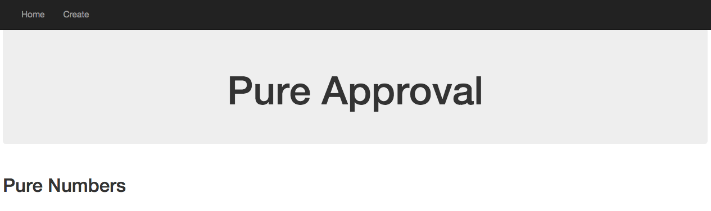
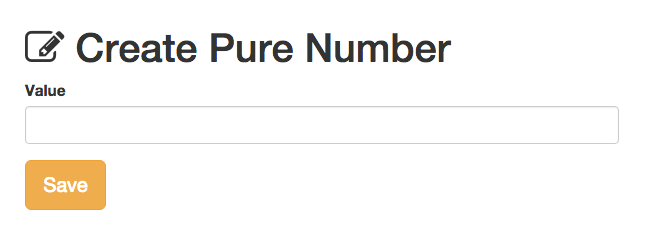
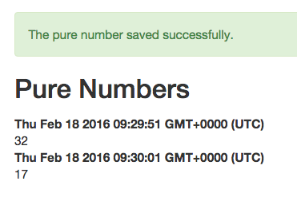
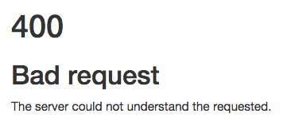

# Pure approval
In this excercise you should write a web application with [express.js](http://expressjs.com/) and persistent data stored by mongoDB through [mongoose.js](http://mongoosejs.com/). This exercise is also about how to validate user input through mongoose Schema and persenting information to the user through "Flash messages".

The application is a simple type where the user can write a number. 

The startpage should have a navigation bar with a home- and a createlink.

When clicking on the create-link the user should see a form that is used for entering a number.

If the number is between 1 and 42 the number should be saved in the database (with a timestamp of the creation) and the user should se a green message that the number is saved when he/she is redirected to to a page where all the number created in the database is presented along with the creation data.

If the user gives a number that is not between 1 and 42 the application should response with a error message

If the user dont write a number in the form (writing text) the apoplication should respond with a 400-error

Of course there should be a custom handling of the 404 error in your application to.
